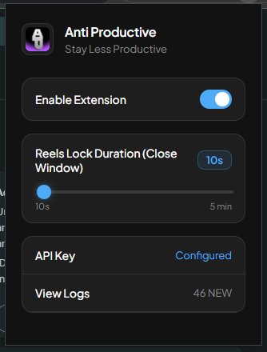
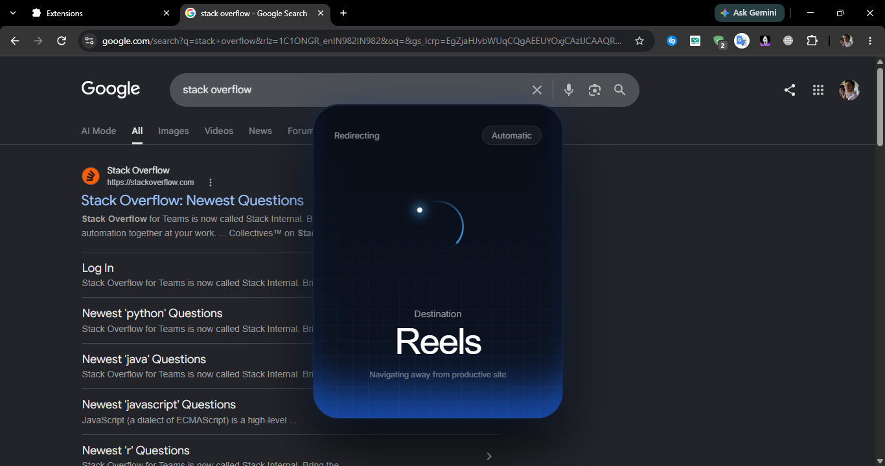
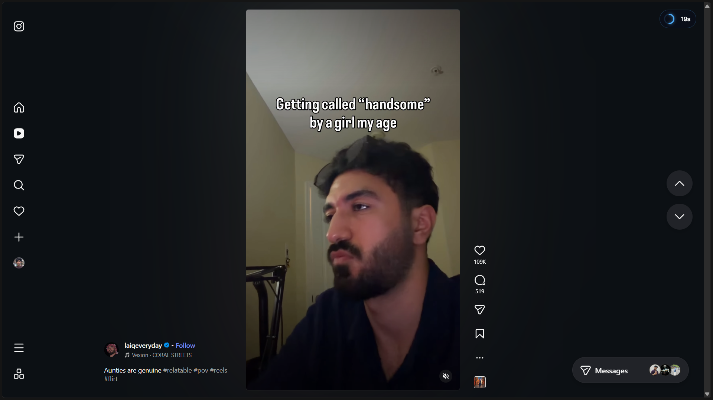
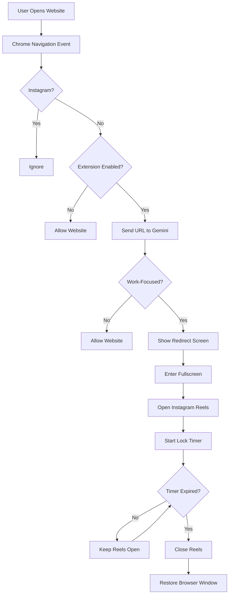

# Anti-Productivity 🎯

<p align="center">
  
</p>

<h3 align="center">Because getting work done is overrated.</h3>

---

## Basic Details

### Team Name:
KRYONEX

### Team Members
- Team Lead: Athuljith Vasudev - Christ College of Engineering
- Member 2: John Antony - Christ College of Engineering


---

## Project Description

**Anti-Productivity** is a Chrome extension designed to actively prevent you from being productive.

Whenever you visit a website that looks like you're actually trying to get work done, the extension uses AI to detect it and immediately redirects you to **Instagram Reels**.

Because apparently opening GitHub should come with consequences.

---

## The Problem (that doesn't exist)

People keep trying to be productive on the internet.

They open:

- GitHub
- Documentation
- Notion
- Figma
- Jira
- Academic research
- Work tools
- Email
- Calendars

This is clearly a serious problem.

Someone had to stop them.

---

## The Solution (that nobody asked for)

We built **Anti-Productivity**.

The extension monitors the websites you visit and uses **Google Gemini** to determine whether you're doing something work-related.

If Gemini decides that you're being productive:

```text
You → Open GitHub
        ↓
    AI detects
    "PRODUCTIVE"
        ↓
   🚨 PUNISHMENT 🚨
        ↓
Instagram Reels
        ↓
Fullscreen + Lock Timer
```

You don't get productivity.

You get Reels.

---

# Technical Details

## Technologies/Components Used

### For Software:

- **JavaScript**
- **HTML**
- **CSS**
- **Chrome Extension Manifest V3**
- **Google Gemini API**
- **Chrome WebNavigation API**
- **Chrome Tabs API**
- **Chrome Windows API**
- **Chrome Scripting API**
- **Chrome Storage API**
- **Chrome Alarms API**

The project is structured as a Manifest V3 extension with a background service worker and popup interface.

---

# Implementation

## How It Works

### 1. Website Detection

The extension listens for completed navigation events.

Every time a webpage is opened, its URL is inspected.

```text
Website Opened
      ↓
Extract URL
      ↓
Check if Instagram
      ↓
Check Extension Status
      ↓
Send URL to Gemini
```

---

### 2. AI Classification

Google Gemini receives the URL and determines whether the website represents **work-focused browsing**.

Examples of websites considered productive:

- GitHub
- Jira
- Notion
- Figma
- Developer documentation
- Coding tools
- Work email
- Calendars
- Academic research

If the website is classified as productive, it is redirected.

---

### 3. Productivity Punishment

When a productive website is detected:

```text
Productive Website
       ↓
Redirect Warning
       ↓
Fullscreen Browser Window
       ↓
Instagram Reels
       ↓
Lock Timer
```

A custom redirect flow is used before the user is sent to Reels.

---

### 4. Reels Lock

Once Instagram Reels opens, the extension starts a lock timer.

The popup allows the user to configure the duration from:

```text
10 seconds → 5 minutes
```

During the lock:

- Instagram Reels remains open
- The browser enters fullscreen
- A countdown timer is displayed
- The session ends automatically after the configured duration

---

### 5. Logging

The extension maintains a log of navigation decisions.

Example:

```text
[14:21:03] Allowed: youtube.com
[14:21:19] Allowed: google.com
[14:22:01] Redirected: github.com
[14:22:02] Redirected: notion.so
```

The popup allows these logs to be viewed and cleared.

---

# Installation

No build system is required.

### Step 1 — Clone the repository

```bash
git clone <your-repository-url>
cd anti-productivity
```

### Step 2 — Open Chrome Extensions

Go to:

```text
chrome://extensions
```

### Step 3 — Enable Developer Mode

Enable:

```text
Developer mode
```

### Step 4 — Load the Extension

Click:

```text
Load unpacked
```

Select the project folder.

---

# Configuration

Click the Anti-Productivity extension icon in Chrome.

The popup provides:

### Enable Extension

Turn the extension on or off.

### Reels Lock Duration

Configure how long the Reels session lasts.

```text
10s ───────────────────────── 5min
```

### API Key

Enter your Gemini API key.

### View Logs

Inspect previous website classifications and redirects.

---

# Screenshots

> Replace these placeholders with actual screenshots from your running extension.

## 1. Extension Popup



*The Anti-Productivity control panel containing the enable switch, Reels lock duration, Gemini API configuration, and logs.*

---

## 2. Productivity Punishment Screen



*The redirect screen shown when the extension detects that the user is attempting to be productive.*

---

## 3. Instagram Reels Lock



*Instagram Reels displayed in fullscreen mode with the countdown lock indicator.*

---

# Diagrams

## Workflow



*Overall workflow of the Anti-Productivity extension.*

---

# Architecture

```text
                  ┌──────────────────────┐
                  │      Chrome Tab      │
                  └──────────┬───────────┘
                             │
                             ▼
                  ┌──────────────────────┐
                  │  webNavigation API   │
                  └──────────┬───────────┘
                             │
                             ▼
                  ┌──────────────────────┐
                  │ Background Service   │
                  │      Worker          │
                  └──────────┬───────────┘
                             │
                             ▼
                  ┌──────────────────────┐
                  │     Gemini API       │
                  │  URL Classification │
                  └──────────┬───────────┘
                             │
                   ┌─────────┴─────────┐
                   │                   │
                   ▼                   ▼
                Not Work             Work
                   │                   │
                   ▼                   ▼
                Allow              Punish
                                       │
                                       ▼
                              ┌────────────────┐
                              │ Instagram      │
                              │ Reels          │
                              └───────┬────────┘
                                      │
                                      ▼
                              ┌────────────────┐
                              │ Fullscreen +   │
                              │ Lock Timer     │
                              └────────────────┘
```

---

# Project Demo

## Video

<video src="screenshots/1.mp4" controls="controls" width="100%">
  Your browser does not support the video tag.
</video>

[▶️ Watch Demo Video (1.mp4)](screenshots/1.mp4)

*The demo shows the extension detecting productive browsing, interrupting the user, opening Instagram Reels, entering fullscreen mode, and enforcing the configured lock duration.*

---

# Additional Demos

[Add GitHub repository / demo GIF / presentation / poster here]

---

# Team Contributions

- **[Name 1]**: Chrome extension architecture, navigation monitoring, redirect logic, fullscreen and lock system.
- **[Name 2]**: Gemini-based website classification and API integration.
- **[Name 3]**: Popup interface, UI/UX design, testing, documentation and demo preparation.

---

# Why Is This Useless?

Because instead of helping people become more productive, this project uses AI to make sure they **don't accidentally accomplish anything**.

You opened GitHub to fix one bug?

> Enjoy Instagram Reels.

You opened documentation?

> Reels.

You opened Notion?

> Reels.

You tried to study?

> **REELS.**

---

# Future Improvements

Possible future upgrades include:

- More sophisticated productivity detection
- Website-specific rules
- Custom punishment websites
- Productivity streak tracking
- Statistics dashboard
- Random punishment durations
- Multiple distraction platforms
- "Are you sure you're working?" confirmation mode
- AI-generated insults before redirecting
- A leaderboard for people who get punished the most

---

# Disclaimer

This project is intentionally designed as a joke / useless-project experiment.

It is **not** intended to improve productivity.

In fact, it does the exact opposite.

---

Made with ❤️ and questionable life choices at TinkerHub Useless Projects


